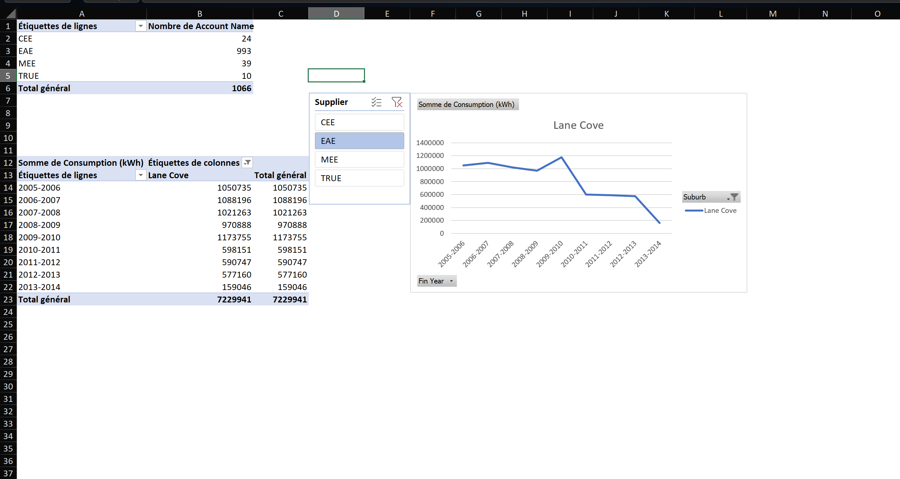
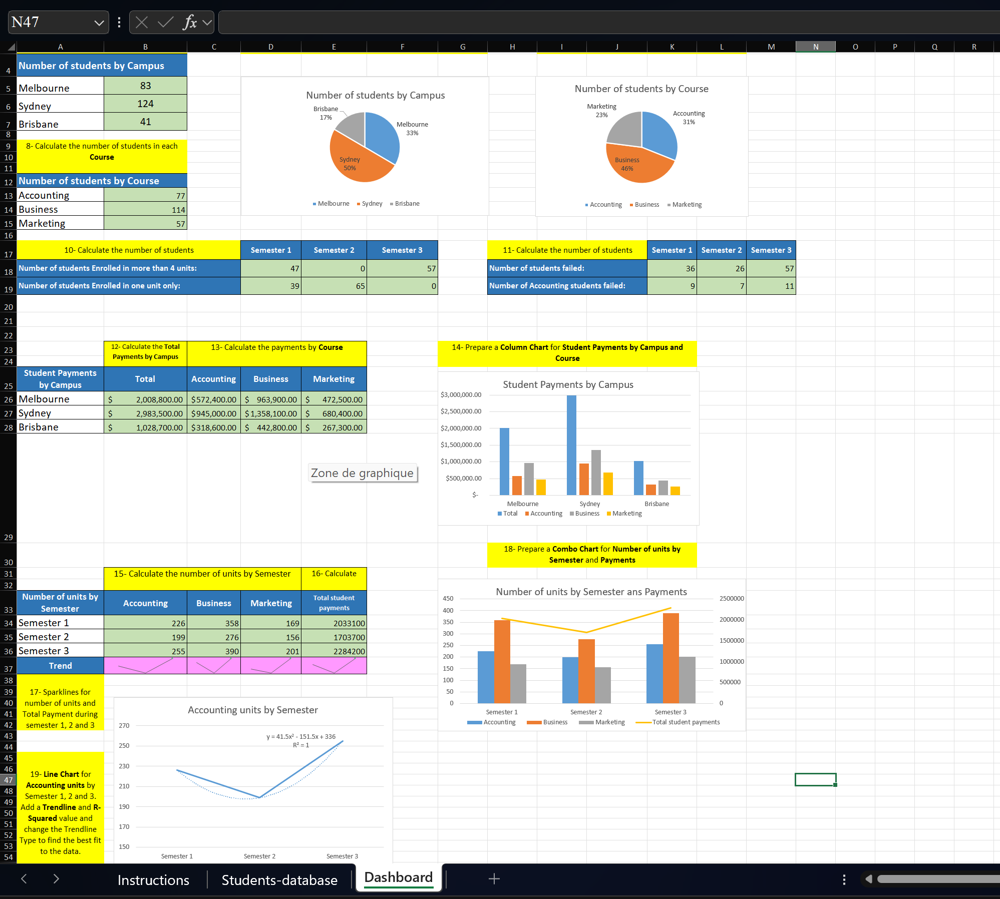

<div align="center">

# 📊 Projets Réalisés : Portfolio Data

**Smide ALEXIS**, *Data Analyst & Data Scientist · Économiste quantitatif*

Économie Quantitative au CTPEA · Science des données avec IBM / Coursera


[](https://www.linkedin.com/in/smide-alexis-741380397/)
[](mailto:alexis.7pr22@outlook.com)

</div>

---

## 🎯 Objet de ce dépôt

Ce dépôt rassemble mes travaux d'analyse et de science des données : modélisation prédictive en Python, tableaux de bord décisionnels, études économétriques et enquêtes statistiques de terrain.

Chaque projet est présenté ci-dessous avec son **contexte**, sa **démarche**, ses **outils** et son **livrable**, afin que le travail puisse être apprécié rapidement.

---

## 🗂️ Organisation

```
01-data-science-python/ Machine learning et visualisation avec Python
02-business-intelligence/ Tableaux de bord Power BI et rapports Excel
03-econometrie-et-statistiques/ Modélisation économétrique et enquêtes statistiques
```

---

## 📌 Vue d'ensemble

| # | Projet | Domaine | Outils | Livrable |
|:--|:--|:--|:--|:--|
| 1 | [Prédiction de l'atterrissage du Falcon 9 (SpaceX)](Presentation_de_projet_DS.pdf) | Machine learning | Python, scikit-learn | PDF |
| 2 | [Tesla & GameStop : cours de bourse et revenus](01-data-science-python/tesla-gamestop-stock-analysis.ipynb) | Web scraping & visualisation | Python, BeautifulSoup, yfinance, Plotly | Notebook |
| 3 | [Prix de l'immobilier à King County, USA](01-data-science-python/king-county-house-sales-regression.pdf) | Régression | Python, pandas, scikit-learn | PDF |
| 4 | [Feux de forêt en Australie](01-data-science-python/australia-wildfire-visualization.pdf) | Visualisation de données | Python, pandas | PDF |
| 5 | [Student Performance Analysis Dashboard](02-business-intelligence/student-performance-dashboard.pdf) | Business Intelligence | Power BI | PBIX + PDF |
| 6 | [Consommation d'énergie de Lane Cove](02-business-intelligence/rapport-consommation-energie.xlsx) | Reporting & TCD | Excel | XLSX + PNG |
| 7 | [Étudiants, cours et paiements : tableau de bord Excel](02-business-intelligence/rapport-analyse-excel.xlsx) | Reporting & tableau de bord | Excel | XLSX + PNG |
| 8 | [Le prix du Bitcoin et les grands agrégats macroéconomiques](03-econometrie-et-statistiques/bitcoin-agregats-macroeconomiques.pdf) | Économétrie | Séries temporelles | PDF |
| 9 | [Aspirations des étudiants : enquête statistique](03-econometrie-et-statistiques/enquete-aspirations-etudiants.pdf) | Statistique appliquée | Enquête, statistique descriptive | PDF |

---

## 🔍 Détail des projets

### 1. Winning Space Race with Data Science : prédiction de l'atterrissage du Falcon 9

> **Domaine** : machine learning · **Outils** : Python, scikit-learn · **Cadre** : projet capstone, *IBM Data Science Professional Certificate* (février 2024)

Le coût d'un lancement spatial dépend directement de la capacité à récupérer le premier étage du lanceur. Ce projet consiste à collecter les données historiques des lancements de Falcon 9, à les explorer, puis à entraîner des modèles de classification capables de prédire la réussite de l'atterrissage, et donc d'estimer le coût réel d'un lancement.

📄 [Consulter la présentation](Presentation_de_projet_DS.pdf)

---

### 2. Tesla & GameStop : cours de bourse et revenus trimestriels

> **Domaine** : collecte de données et visualisation · **Outils** : Python (requests, BeautifulSoup, yfinance, pandas, Plotly)

Projet entièrement codé en Python : extraction des cours historiques de Tesla et GameStop via l'API **yfinance**, récupération des revenus trimestriels par **web scraping** (requests + BeautifulSoup), nettoyage et structuration des données dans des DataFrames, puis construction de graphiques interactifs **Plotly** superposant l'évolution du cours et celle du chiffre d'affaires.

L'objectif : mettre en regard la valorisation boursière et la performance financière réelle des deux entreprises.

📓 [Ouvrir le notebook](01-data-science-python/tesla-gamestop-stock-analysis.ipynb)

---

### 3. House Sales in King County, USA : estimation du prix des logements

> **Domaine** : analyse exploratoire et régression · **Outils** : Python (pandas, NumPy, SciPy, Seaborn, Matplotlib, scikit-learn)

Mission d'analyste de données pour un fonds d'investissement immobilier souhaitant se positionner sur le résidentiel : déterminer le prix de marché d'un logement à partir de ses caractéristiques. Le jeu de données couvre **21 613 transactions** décrites par **22 variables** (surface habitable, chambres, salles de bain, état général, vue sur l'eau, année de construction, localisation…).

**Démarche** : nettoyage et typage des données, traitement des valeurs manquantes, analyse exploratoire et étude des corrélations, puis modélisation avec régression linéaire simple et multiple, régression polynomiale et régression Ridge. Le tout industrialisé avec des *pipelines* scikit-learn (standardisation, transformation polynomiale), une validation croisée et une optimisation des hyperparamètres par recherche sur grille. Évaluation par le R² et l'erreur quadratique moyenne.

📄 [Consulter le rapport](01-data-science-python/king-county-house-sales-regression.pdf)

---

### 4. Wildfire Activities in Australia : analyse et visualisation

> **Domaine** : visualisation de données · **Outils** : Python (pandas, Matplotlib, Seaborn), tableau de bord interactif

Analyse des tendances et des schémas d'activité des feux de forêt selon les régions australiennes. Le travail aboutit à un ensemble de visualisations puis à un tableau de bord interactif permettant à l'utilisateur de sélectionner la **région** et l'**année** pour explorer les données à sa convenance.

📄 [Consulter le rapport](01-data-science-python/australia-wildfire-visualization.pdf)

---

### 5. Student Performance Analysis Dashboard (Power BI)

> **Domaine** : business intelligence · **Outils** : Power BI Desktop

Tableau de bord interactif analysant les résultats scolaires de **100 étudiants** en mathématiques, lecture et écriture.

**Indicateurs clés** : score moyen global de **61,18** (mathématiques 62,51 · écriture 60,53 · lecture 60,49).

**Axes d'analyse** : les performances sont ventilées par genre, origine ethnique, niveau d'études des parents et participation à un programme de préparation aux examens. Le rapport intègre des filtres dynamiques, un diagramme de flux croisant origine et éducation parentale, ainsi qu'un classement des cinq meilleurs étudiants.

📊 [Aperçu PDF](02-business-intelligence/student-performance-dashboard.pdf) · 📁 [Fichier source .pbix](02-business-intelligence/student-performance-dashboard.pbix) *(nécessite Power BI Desktop)*

---

### 6. Consommation d'énergie de la commune de Lane Cove (Excel)

> **Domaine** : reporting et analyse tabulaire · **Outils** : Excel (tableaux croisés dynamiques, segments, graphiques croisés dynamiques)

Analyse d'un portefeuille de **1 066 comptes clients** répartis entre quatre fournisseurs d'électricité, et suivi de la consommation de la commune de **Lane Cove** sur neuf exercices (2005-2006 à 2013-2014), pour un cumul de **7 229 941 kWh**.

**Démarche** : construction de tableaux croisés dynamiques pour compter les comptes par fournisseur et agréger la consommation par exercice, mise en place de **segments interactifs** (fournisseur, commune, exercice) et d'un graphique croisé dynamique de suivi temporel.

**Lecture** : la consommation se maintient autour de 1 000 000 kWh par an jusqu'en 2009-2010 (pic à 1 173 755 kWh), puis chute brutalement à partir de 2010-2011 (598 151 kWh) et poursuit sa baisse jusqu'à 159 046 kWh en 2013-2014.

<p align="center">

</p>

📁 [Ouvrir le classeur Excel](02-business-intelligence/rapport-consommation-energie.xlsx) · 🖼️ [Aperçu en grand](02-business-intelligence/rapport-consommation-energie-apercu.png)

---

### 7. Étudiants, cours et paiements : tableau de bord Excel

> **Domaine** : reporting et tableau de bord · **Outils** : Excel (formules de comptage conditionnel, graphiques en secteurs, histogrammes, graphique combiné, sparklines, courbe de tendance)

Tableau de bord complet construit à partir d'une base de **248 étudiants** répartis sur trois campus (Sydney 124, Melbourne 83, Brisbane 41) et trois filières (Business 114, Accounting 77, Marketing 57).

**Contenu du tableau de bord** : répartition des effectifs par campus et par cours, nombre d'étudiants inscrits à plus de quatre unités ou à une seule unité par semestre, nombre d'échecs par semestre (dont les échecs en comptabilité), paiements totaux par campus et par filière (Sydney 2 983 500 USD, Melbourne 2 008 800 USD, Brisbane 1 028 700 USD), nombre d'unités par semestre avec sparklines de tendance, graphique combiné unités / paiements, et courbe de tendance polynomiale sur les unités de comptabilité (R² = 1).

<p align="center">

</p>

📁 [Ouvrir le classeur Excel](02-business-intelligence/rapport-analyse-excel.xlsx) · 🖼️ [Aperçu en grand](02-business-intelligence/rapport-analyse-excel-apercu.png)

---

### 8. Le prix du Bitcoin et les grands agrégats macroéconomiques

> **Domaine** : économétrie appliquée · **Cadre** : cours d'Économétrie 1, CTPEA

Analyse économétrique trimestrielle du prix du Bitcoin en fonction des principaux agrégats économiques des pays développés et des pays les plus peuplés, sur la période **2012-2023**. Le travail articule construction de la base de données, spécification du modèle, estimation et interprétation économique des résultats.

📄 [Consulter le mémoire](03-econometrie-et-statistiques/bitcoin-agregats-macroeconomiques.pdf)

---

### 9. Aspirations des étudiants : enquête statistique

> **Domaine** : statistique appliquée · **Cadre** : Atelier de Statistique Appliquée, CTPEA (décembre 2023)

Enquête de terrain sur les aspirations des étudiants : problématique, hypothèses et objectifs, choix des matériels et méthodes, définition des variables, puis analyse des résultats (répartition par niveau d'étude et par sexe, départements d'études souhaités).

📄 [Consulter le rapport](03-econometrie-et-statistiques/enquete-aspirations-etudiants.pdf)

---

## 🧠 Compétences mises en œuvre

| Domaine | Détail |
|:--|:--|
| **Langages** | Python, R, SQL |
| **Manipulation de données** | pandas, NumPy, nettoyage, traitement des valeurs manquantes, jointures, agrégations |
| **Collecte** | API (yfinance), web scraping (requests, BeautifulSoup) |
| **Machine learning** | Régression linéaire, polynomiale et Ridge, classification, pipelines, validation croisée, recherche d'hyperparamètres |
| **Économétrie & statistique** | Séries temporelles, modélisation macroéconomique, conception d'enquête, statistique descriptive et inférentielle |
| **Visualisation & BI** | Power BI, Plotly, Matplotlib, Seaborn, tableaux de bord interactifs |
| **Excel avancé** | Tableaux croisés dynamiques, segments, graphiques combinés, sparklines, courbes de tendance |

---

## 📫 Contact

<div align="center">

[](https://www.linkedin.com/in/smide-alexis-741380397/)
[](mailto:alexis.7pr22@outlook.com)
[](https://github.com/Smithy-22)

**Smide ALEXIS** · Port-au-Prince, Haïti · +509 3388 9930

*Ouvert aux opportunités en analyse de données, business intelligence et data science.*

</div>
